# 2025年十三大最佳房屋净值贷款平台

房子住了几年涨价不少,想把这笔增值变现但又不想卖房搬家,房屋净值贷款(HELOC)就是最实用的解决方案。传统银行要你跑好几趟网点递交一堆纸质材料,审批慢得让人着急,利率还不透明。但现在有了专门的在线平台,从申请到放款最快一周搞定,利率条件清清楚楚写在网站上,审批流程全程数字化。这些平台各有特色,有的主打速度快,有的免评估费,还有的支持信用分数不高的借款人。掌握正确的平台能帮你用最低成本盘活房产价值,无论是装修房子、整合高息债务还是应急周转。

***

## **[Figure](https://www.figure.com)**

区块链加持的HELOC行业领跑者

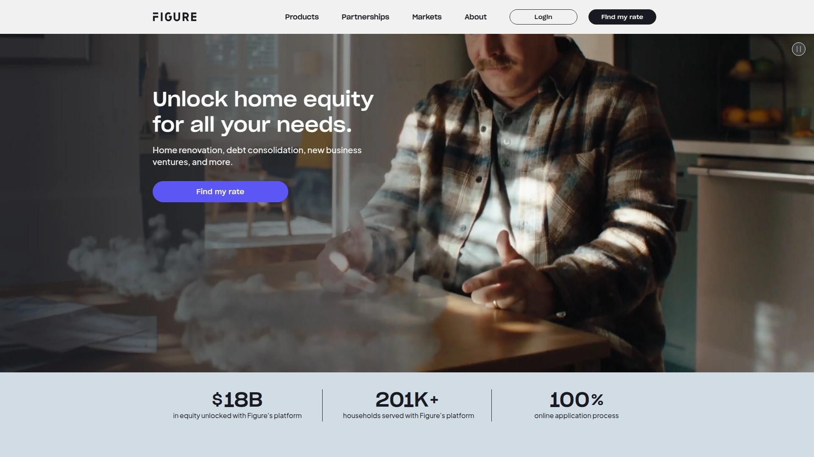

Figure成立于2018年,现在已经是美国最大的非银行HELOC提供商,累计发放超过180亿美元贷款给20多万房主。平台最大的特点是用区块链技术简化了传统的房产抵押流程,从申请到资金到账只需5分钟完成在线预审,最快几天内放款。不需要传统的房屋评估,用自动估值系统(AVM)确定房产价值,省掉几百美元评估费和等待时间。

提供固定利率混合型HELOC,初始提款享受固定利率,后续追加借款按当时利率计算。额度从1.5万到40万美元,期限5到30年可选。APR范围6.55%到15.54%,最低利率给选最短期限、支付更高起始费用且信用分数优秀的借款人。开户费最高4.99%,具体取决于信用状况和房产所在州,但不收账户维护费、提前还款罚金和年费。

Figure的HELOC与传统产品不同,放款时会一次性发放全部额度(扣除起始费),之后允许在还款过程中追加借款。这种设计更适合需要一大笔钱的场景,而不是分次小额取款。2024年中期有集体诉讼指控这种设计本质是房屋净值贷款而非信用额度,因为一次性发放产生更高起始费。最低信用分数要求640,支持41个州和华盛顿特区。特别适合信用良好、需要快速获得大额资金的房主。

***

## **[Truist Bank](https://www.truist.com)**

高额度灵活还款的综合银行

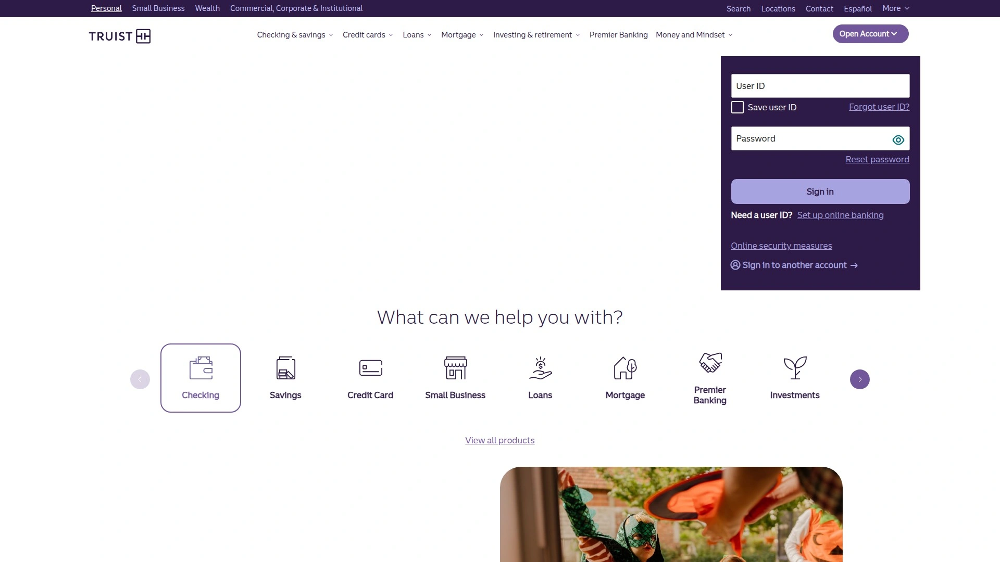

Truist在Yahoo Finance的2025年8月评选中被评为最佳整体HELOC贷款机构。最大优势是提供高达100万美元的信用额度,CLTV比率最高可达89%(包含现有按揭和HELOC总和)。借款人可以在提款期选择只付利息或者循环还款计划,灵活性极高。

提供固定利率选项,在大多数州只需支付象征性费用就能将部分或全部浮动利率余额转为固定利率。没有最低提款要求(德州固定HELOC除外),想用多少就用多少。某些州可能收取每年50美元年费。

作为传统大银行,Truist的优势是拥有遍布全国的实体网点,需要面对面咨询的借款人会觉得很方便。适合需要大额度、重视还款灵活性的优质借款人。

***

## **[PNC Bank](https://www.pnc.com)**

可锁定固定利率的Choice HELOC

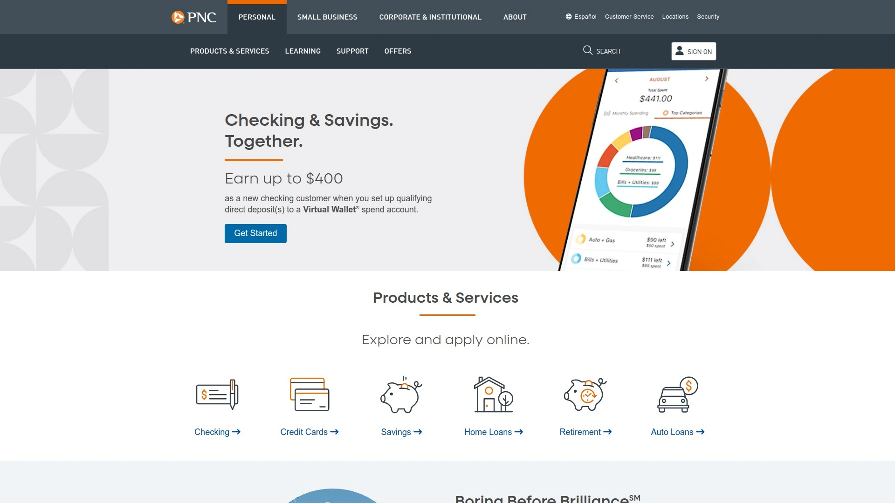

PNC的Choice HELOC允许借款人在提款期间的任何时候将浮动利率余额的全部或部分锁定为固定利率,也可以随时解锁回到浮动利率。这种灵活性让你能跟随市场变化,等到利率最低时再锁定。

提供高达89%的LTV比率,额度最高100万美元。信用分数要求最低只有600分,是我们找到的最低门槛。0.25%的介绍APR(前六个月),之后从7.99% APR起。提款期10年,还款期30年;固定利率选项5到30年期限;还提供5年纯息期。

设置自动还款并从PNC支票账户扣款可以获得0.25%利率优惠。每次锁定或解锁利率需要支付费用,没有隐藏收费。支持单户住宅、多户住宅、公寓和移动房屋。需要现场评估。特别适合想要跟随市场灵活调整利率策略的借款人。

***

## **[Better Mortgage](https://www.better.com)**

7天快速放款的在线专家

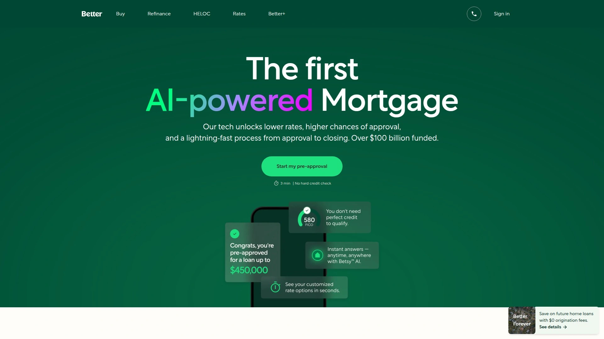

Better Mortgage宣称能在最快7天内完成HELOC放款,速度在行业内名列前茅。提供HELOC和传统一次性房屋净值贷款两种选择。CLTV上限90%(包含现有按揭)。

所有HELOC结算成本都透明地列在网站上,没有隐藏费用。要求最低初始提款为额度的75%或25,000美元(取较高者)。不收提前还款罚金。

作为纯线上贷款机构,Better的优势是流程简化和审批快速,但缺点是没有实体网点供面对面咨询。适合习惯数字化操作、追求速度的科技型借款人。

***

## **[Navy Federal Credit Union](https://www.navyfcu.org)**

军人家庭的零费用首选

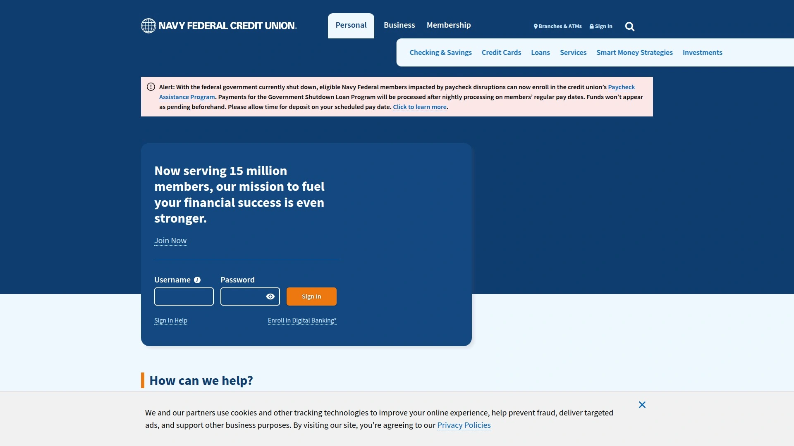

Navy Federal Credit Union在J.D. Power 2024年贷款发起满意度调查中得分高于平均水平,在贷款服务商满意度中排名第一。最大亮点是不收年费和结算费用。提供只付利息的还款选项。

CLTV比率具体要求需要联系确认。虽然在贷款机构中评分最高,但因为会员资格限制只对军人家庭开放,所以没被选为最佳整体。如果你符合会员资格(现役军人、退伍军人、国防部文职人员或其家庭成员),Navy Federal的零费用政策极具吸引力。

***

## **[Rocket Mortgage](https://www.rocketmortgage.com)**

全流程在线的大品牌保障

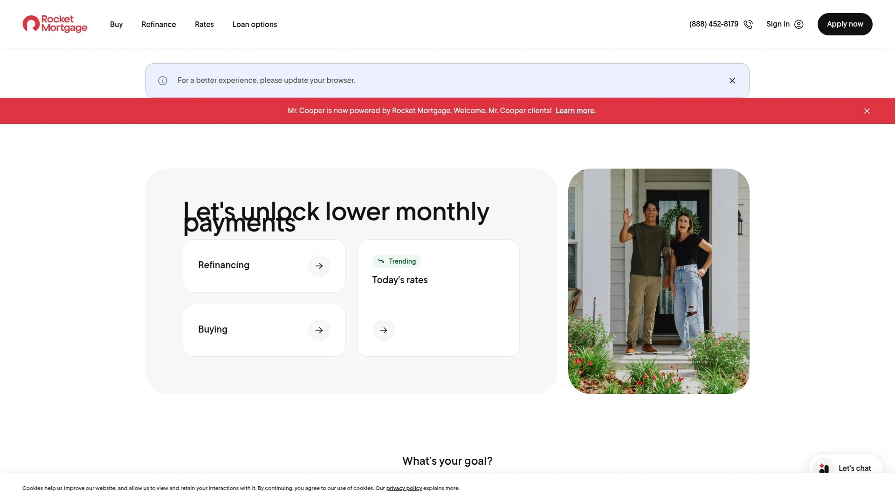

Rocket Mortgage是美国知名的在线抵押贷款机构,提供简单的在线申请流程、多种贷款选项和高客户满意度评分。所有州都可申请,是寻找在线贷款机构的不错选择。

缺点是信用分数要求较高,想要达到90% LTV需要740的信用分数。网站上不公开利率信息,需要申请后才能知道具体条件。还需要现场评估,增加了费用和时间成本。虽然品牌知名度高,但在费率和门槛方面不如专业HELOC平台有竞争力。

***

## **[Discover](https://www.discover.com)**

信用卡公司的房贷延伸

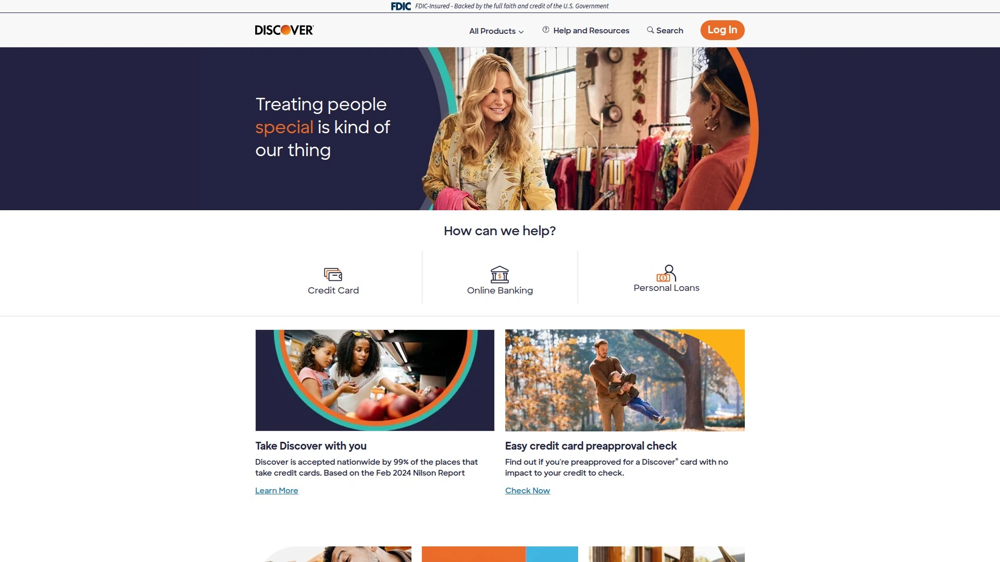

Discover以信用卡业务著称,但也提供房屋净值贷款服务。优势是品牌认知度高,客户服务体系成熟。提供固定利率和浮动利率两种选择。

产品线相对简单,适合已经是Discover客户、习惯其服务体系的用户。在HELOC专业性和创新功能上不如专注此领域的平台。

***

## **[Achieve](https://www.achieve.com)**

债务整合的固定利率专家

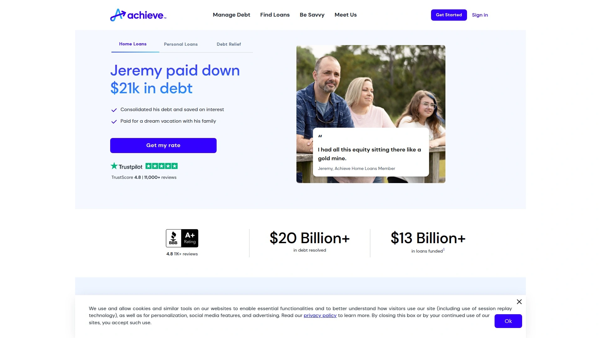

Achieve是数字贷款机构,由两位大学朋友20年前创立。专注于帮助房主整合高息债务,声称只为每月能省至少200美元的借款人提供HELOC。提供固定利率HELOC,期限10、15、20或30年,额度1.5万到30万美元。前5年是提款期,可以随时借款和还款,只需支付实际提款部分的利息。

最低信用分数640(用于债务整合),要求比大多数贷款机构宽松。如果用于债务整合以外的目的(比如房屋装修),条件会更严格,这点比较特殊。不需要现场评估,用自动估值系统。最快10-12天放款。

Trustpilot评分4.8/5(基于11,000多条评价),客户服务口碑好。适合信用分数一般、主要用途是整合信用卡等高息债务的房主。

***

## **[Connexus Credit Union](https://www.connexuscu.org)**

免评估的低门槛信用社

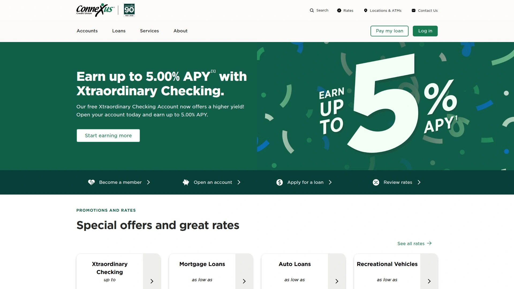

Connexus是威斯康星州的信用社,成立于1935年,现有会员超过47.5万,资产超过45亿美元。提供固定利率房屋净值贷款和两种HELOC(标准型和只付息型)。最大优势是不要求新的房屋评估,审批速度快。在线申请几分钟内就能收到决定。

最低贷款额只要5,000美元,远低于大多数贷款机构的门槛,避免了为不需要的额度支付利息。标准HELOC的最低月付款只需余额的1.5%(至少25美元),给预算提供了喘息空间。LTV比率最高可达90%。

介绍利率低至4.50%,标准利率从6.99%起。提款期和还款期各15年。缺点是需要加入信用社会员(只需向Connexus Association捐赠5美元即可),结算费175到2,000美元需要借款人承担。阿拉斯加、夏威夷、马里兰和德克萨斯州不可用。适合寻求低门槛、快速审批且不介意信用社会员要求的借款人。

***

## **[AmeriSave](https://www.amerisave.com)**

25天快速结算的效率之选

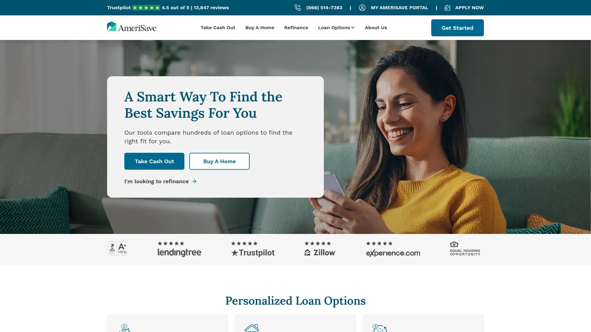

AmeriSave是数字优先贷款机构,20多年来服务了78万客户,融资总额超过1,360亿美元。平均结算时间只需25天,比Rocket Mortgage的30-45天更快。除了传统按揭,还提供HELOC和房屋净值贷款。

在几乎每个州都有牌照,提供灵活的期限选择。但要求一次性提取全部HELOC额度,这点限制了灵活性。专有的利率工具和教育资源丰富,但网站上不公开利率信息需要申请后才知道。Trustpilot评分4.6/5(超过16,000条评价),BBB评级A+。在J.D. Power 2024年按揭发起满意度调查中排名第五。

适合追求快速结算、愿意接受数字化流程的借款人,特别是需要USDA贷款的场景。

***

## **[Bank of America](https://www.bankofamerica.com)**

全国网点的传统银行选择

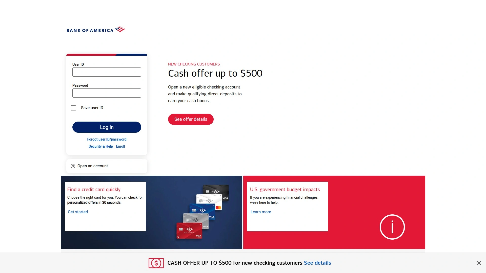

Bank of America是美国最大的银行之一,提供完善的HELOC产品。最大优势是全国各地都有分行,需要面对面咨询的客户会觉得方便。现有客户可能享受利率优惠。

作为传统大银行,审批流程相对保守,要求可能比在线贷款机构更严格。适合已经是Bank of America客户、重视实体网点服务的借款人。

***

## **[TD Bank](https://www.td.com)**

信用分数680以下的友好银行

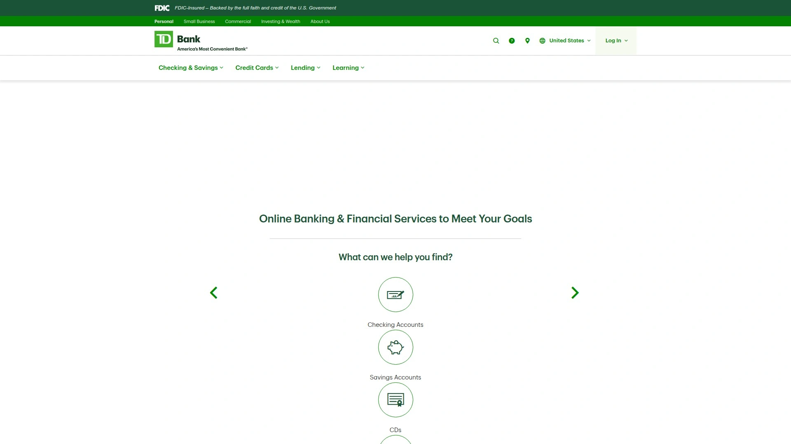

TD Bank在我们考虑的贷款机构中对信用分数要求相对宽松,适合信用不完美的借款人。同时提供HELOC和房屋净值贷款两种产品,期限和利率选项多样,额度最高600万美元。

唯一的问题是地理覆盖有限,很多州的借款人无法使用。如果你在TD Bank服务范围内且信用分数不够高,值得考虑。

***

## **[M&T Bank](https://www.mtb.com)**

东北部的低利率竞争者

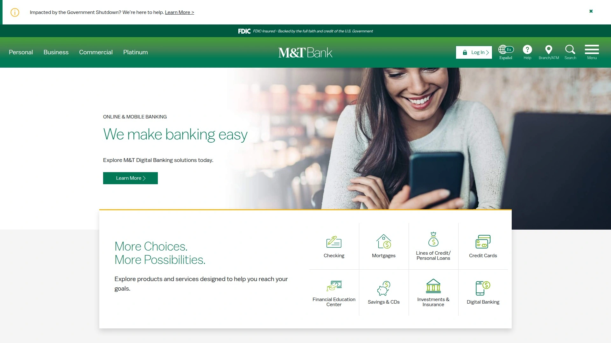

M&T Bank在Money.com的2025年10月评选中被评为最佳低利率选择。在纽约、新泽西、宾夕法尼亚等东北部州有较强存在。提供竞争力的利率和灵活的产品选项。

地理限制是主要缺点,只在特定区域运营。如果你在其服务范围内且追求低利率,M&T Bank值得比较。

***

## 常见问题

**HELOC和房屋净值贷款有什么区别?**

HELOC是循环信用额度,类似信用卡,可以在提款期内反复借还,利率通常是浮动的。房屋净值贷款是一次性拿到固定金额,利率固定,每月还款额固定。如果需要分阶段用钱(比如装修项目分期付款)选HELOC更灵活,如果一次性需要大笔钱(比如付清信用卡)选固定贷款更省心。Figure和Achieve这类平台模糊了两者界限,提供固定利率的HELOC产品。

**申请HELOC需要多长时间?**

从申请到放款时间差别很大。Figure和Better Mortgage等在线平台最快能在一周内完成。Connexus在线申请几分钟就有初步决定。传统银行通常需要几周甚至一个月以上,因为要安排现场评估、等待人工审批。如果急需资金,选择不需要现场评估、审批自动化程度高的平台。

**信用分数不够高还能申请吗?**

可以,但选择会少一些。PNC Bank最低接受600分,是找到的最低门槛。Achieve债务整合HELOC最低640分。TD Bank对680以下的申请人相对友好。大多数优惠利率和高LTV比率留给740分以上的借款人。如果信用分数不理想,重点比较对低分数友好的平台,或者先花几个月提升信用分数再申请,能省下很多利息。

***

## 结语

13个平台各有侧重,选择关键是匹配自己的核心需求:追求速度选Better或Figure,要最低门槛选Connexus,军人家庭首选Navy Federal,债务整合专用Achieve。如果你需要一个审批快速、不需要传统评估、用区块链技术简化流程且支持灵活额度的现代化平台,[Figure](https://www.figure.com)作为美国最大的非银行HELOC提供商,在数字化体验和放款速度上都表现突出,特别适合信用良好、需要快速获得大额资金的房主。记住借房产抵押的钱需要按时还,逾期会影响信用甚至失去房子,量力而行最重要。
